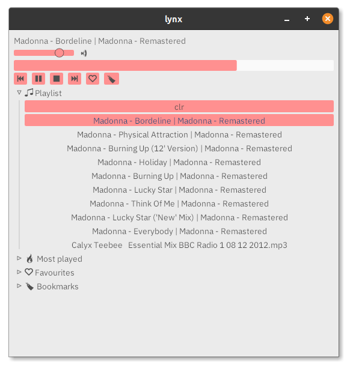

# lynx
## A _very_ minimal audio player

This is a for-fun minimal audio player. It's written as a challenge to replicate something that works like xmms or winamp in Rust.

Features:
- playlist

Formats supported:
- wav
- flac
- mp3
- ogg

TODO:

- [ ] Bookmark support for individual files (For multiple audiobooks)
- [ ] Play count
- [ ] Favorites
- [ ] Themes
- [ ] Preload next song 
- [ ] Recursively add dropped folders
- [X] Auto-build for mac,win and linux
- [X] Drag and drop files into window
- [x] Scrub through songs